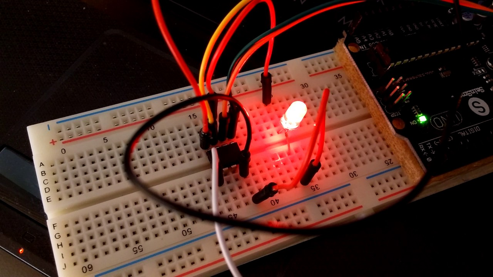
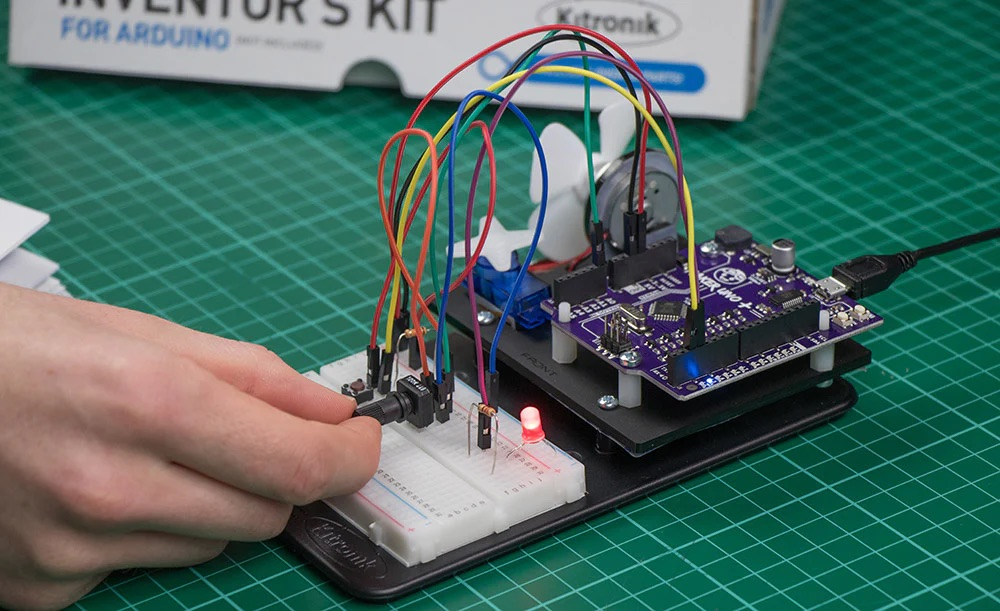

# Week 4

### Labs

In the labs this week, we completed several foundational activities to familiarise ourselves with Arduino and basic electronics:

- **Lab 1:** **LED Blink**  
  First up was the classic LED blink project. I set up my circuit on a breadboard, and when I uploaded my first sketch - seeing the LED light up and blink according to my code was so rewarding! It felt like magic, and I couldn't help but smile at my tiny victory.

  

  [Watch Video](link_to_video_1)

  [Arduino Code](./arduino-code/labs/blink/)

---

- **Lab 2:** **Button and LED**  
  Next, we moved on to connecting a button to control the LED. This was where things started to feel a bit more interactive. I remember the thrill of pressing the button and seeing the LED respond. It was such a simple action, but it made me realize how intuitive interaction design can be. This project made me excited about the possibilities of creating more engaging experiences in the future!

  **Wiring the button and LED**  
  

  **Button control demonstration**  
  [Watch Video](link_to_video_2)

  [Arduino Code](./arduino-code/labs/blink/)

---

- **Lab Activity 3:** **Analog Input with Potentiometer**  
  We experimented with a potentiometer to control the brightness of an LED. This was my favorite part because it visually demonstrated how analog signals can affect outputs, giving me a deeper appreciation for responsive design. Adjusting the potentiometer felt satisfying, as I could directly manipulate the light intensity. It emphasized how small changes in input can have significant impacts on the output, which is a crucial concept in design.

  **Potentiometer connected to the LED**  
  

  **Brightness control demonstration**  
  [Watch Video](link_to_video_3)

  [Arduino Code](./arduino-code/labs/blink/)

---

### Reading & Reflections

This week, my readings profoundly shaped my understanding of material choices and design context in my creative practice. _An Introduction to Discard Studies_ highlighted how the act of discarding materials can perpetuate societal inequalities, prompting me to reflect on how my material selections might affect project accessibility. _Creative Upcycling_ inspired me to consider repurposing old electronics, emphasizing the importance of making technology both accessible and environmentally sustainable. Meanwhile, _The Psychology of Data Visualization_ underscored the impact of design decisions on data perception, which I plan to incorporate into my project visualizations. Collectively, these insights have deepened my awareness of the interconnectedness between materials, social responsibility, and effective design, and I am eager to apply them in my future work.

---

### Peer Support

During our peer support session, we shared our initial ideas for the mid-term project and offered feedback on each other’s concepts. I received valuable input on how to refine my idea and make it more interactive, especially regarding the use of sensors and materials. This collaboration helped clarify my vision for the project.

---

### Project Development

For my mid-term project, I am considering remixing a simple animatronic face project. This week, I started brainstorming how I could use recycled materials for the face structure. I’m interested in incorporating sensors to create a more interactive experience, and I want to ensure that my design is both functional and sustainable
