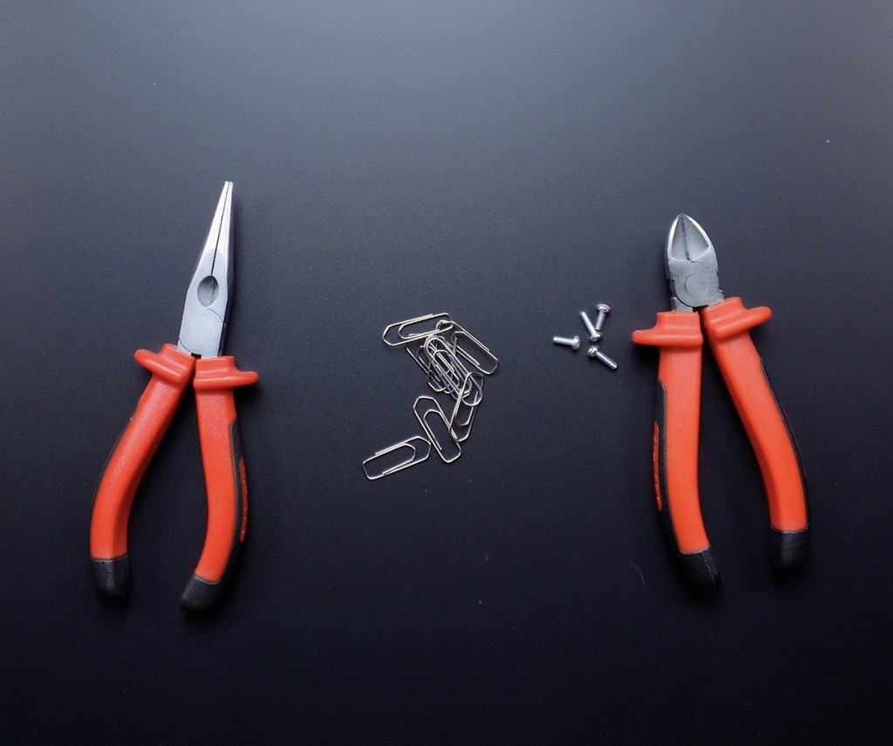
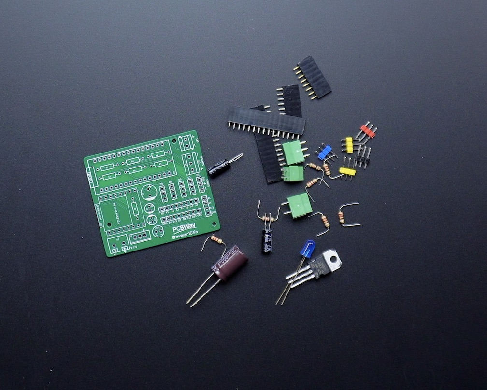
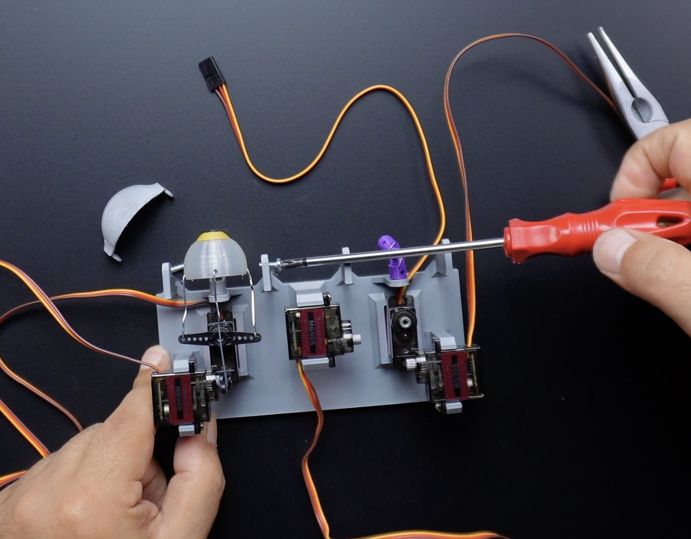
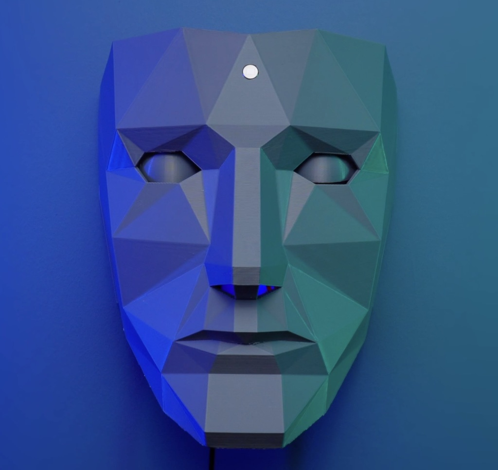
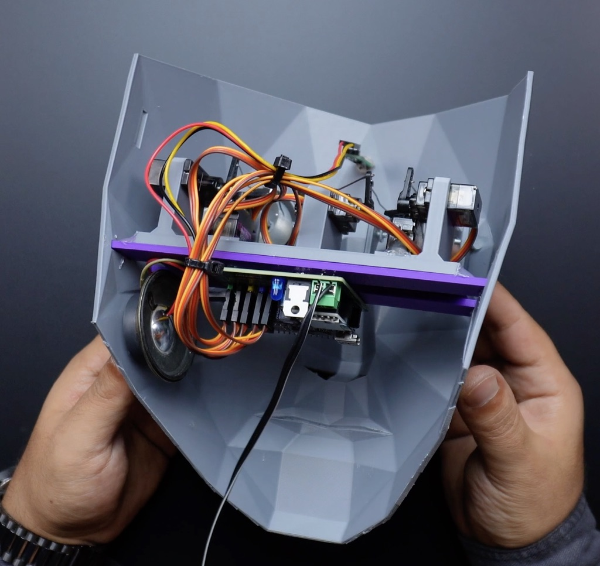
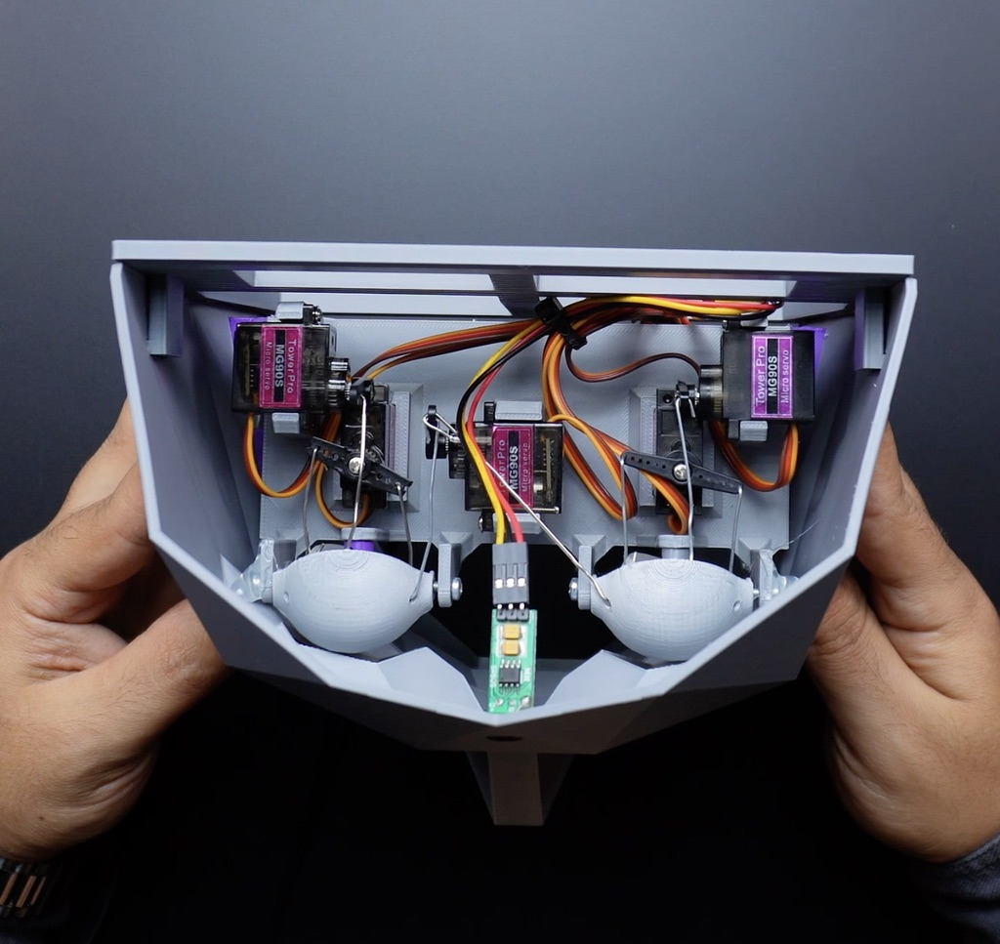

# Mid-Term Project: Remixing in Communities of Practice

**Project Title -** Inclusive Animatronic Face with Customizable Voice Lines  
---

## Overview

### Original Project:  
[Face With Animatronic Eyes, Motion Detection, and Voice](https://www.instructables.com/Face-With-Animatronic-Eyes-Motion-Detection-and-Vo/)

### Project Description:  
The original project features an animatronic face with moving eyes that react to motion detected by a PIR sensor, along with pre-programmed voice lines triggered by movement. The project is powered by an Arduino Nano and includes two servos for eye movement (output) and a PIR sensor for motion detection (input). It is designed to simulate lifelike interactions, responding to nearby motion with eye movement and sound.

---
## Revision Overview

### Element Chosen for Revision:  
I chose to revise the form factor of the animatronic face and diversify the voice line triggers based on distance detection.

### Reason for Revision:  
The original face design, while innovative, was difficult for beginners and lacked flexibility for a wide range of users. My revision focuses on making the project more accessible to individuals from diverse backgrounds and skill levels. By creating a modular, easy-to-assemble face structure, I aim to open up this project to makers with limited access to advanced tools and materials, including those from underrepresented communities in technology. 

---
## Supplies & Materials

### Components Used:  
- **Arduino Board**: Arduino Nano  
- **Input Components**: PIR motion sensor, ultrasonic distance sensor (for new voice line triggers)  
- **Output Components**: Two servos (animating the eyes), speaker module (for voice lines)  
- **Additional Materials**: 3D-printed modular face structure, wires, breadboard, power supply, eco-friendly filament for printing

### Images:  
 

---

## Process

1. I gathered all the necessary components, including the Arduino Nano, PIR sensor, servos, and 3D-printed face parts.

2. I assembled the animatronic eyes by attaching the servos to the eye sockets and connecting them to the Arduino.

 

3. I wired the PIR sensor to detect motion and trigger the servos for eye movement.

4. I redesigned the face structure to be modular. I 3D-printed smaller, easy-to-assemble parts, making the project accessible to those with limited technical experience or fewer fabrication resources.

 

5. Add an ultrasonic distance sensor to trigger different voice lines depending on how close someone is to the face. This makes the system more interactive and adaptable for use in educational or artistic contexts, where it could represent different cultural stories or experiences.

6. Upload the Arduino code to manage the motion detection, eye movement, and voice lines based on proximity.

 

---

## Video Demonstration

[Watch the video demonstration here](https://www.youtube.com/watch?v=H712Cc5Ca94)

---

## Final Project Images

1.   
2.   
3. 

---

## Arduino Code

The Arduino code for this project is available [here](/arduino-code/midterm/).

---

## Design Justification 

The original animatronic face design was visually impressive but inaccessible to beginners and makers with limited resources. By revising the face structure to be modular and 3D-printed with eco-friendly materials, I made the project easier to build and more environmentally responsible. This revision also democratizes the project, making it available to a broader audience, including those from underrepresented communities in tech. I further customized the voice line system by integrating an ultrasonic sensor to trigger different sounds based on proximity. This allows the project to adapt to different cultural contexts, where it can reflect diverse narratives or be used in educational settings to highlight the voices of marginalized communities. These revisions are intended to make the project both more accessible and culturally meaningful.
