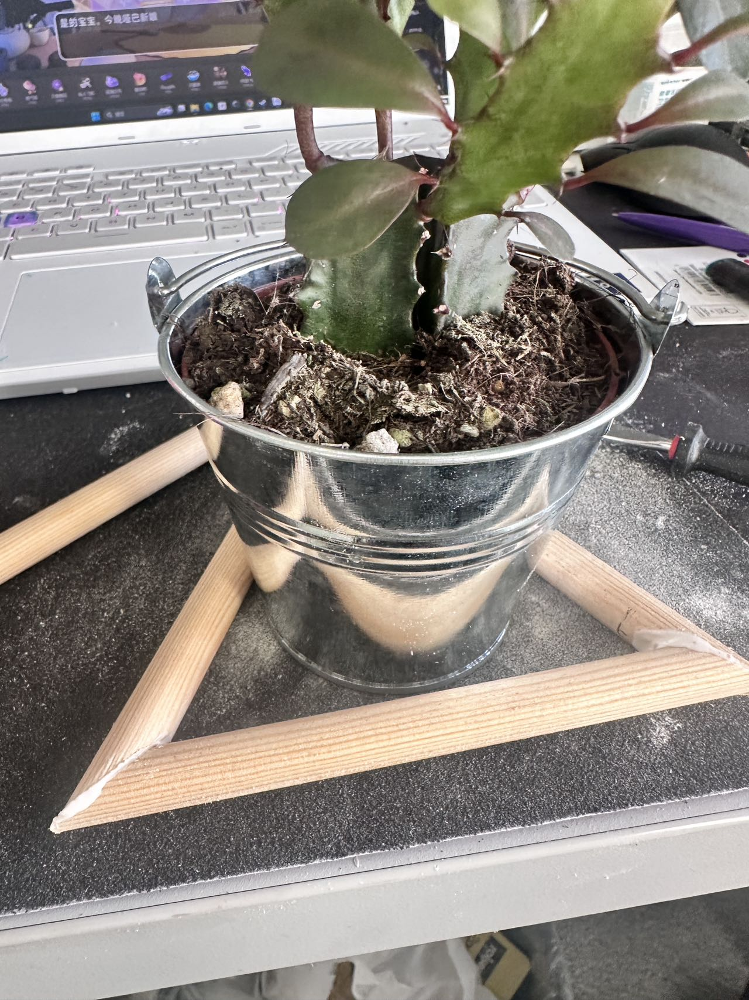
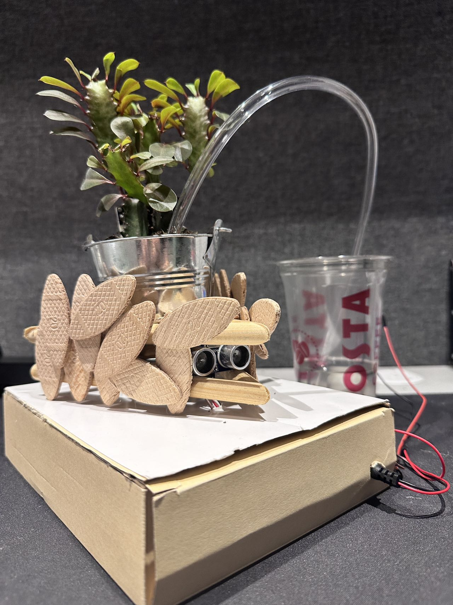

# Mid-Term Project: Remixing in Communities of Practice

**Project Title -**  Laurel (Automatic Watering and Pet Deterrent Device)
---

## Overview

### Original Project:  
[Automatic Plant Watering System Using Arduino in an Easy Way](https://www.instructables.com/Automatic-Plant-Watering-System-Using-Arduino-in-a/)

### Project Description:  
The original project used a soil moisture detection device to determine the current moisture level of the soil, and activated a water pump when the moisture was too low, thus achieving automatic watering for plants. In this iteration, I added protection to the exposed circuits to prevent water splashes from damaging the delicate electronic components when the pump is operating. I also aesthetically improved the device using natural materials like wood. Additionally, I designed a pet deterrent function using an ultrasonic distance sensor and a small servo motor.

---
## Revision Overview

### Element Chosen for Revision:  
While retaining the original functionality, I added protection to the circuit and introduced a new, practical feature.

### Reason for Revision:  
Tn addition to the automatic watering function, the water pump’s operation might draw the curiosity of household pets (cats and dogs), potentially causing damage to electronic components (chewing, knocking off high places, breaking wires, etc.). Therefore, I added a pet deterrent feature to help keep the device intact, especially when the owner is away for extended periods.

---
## Supplies & Materials

### Components Used:  
- **Arduino Board**: Arduino Uno  
- **Input Components**: Ultrasonic distance sensor, Soil moisture sensor
- **Output Components**: Water pump, Servo motor, Buzzer
- **Additional Materials**: Wood, Wood chips，wires, breadboard, power supply, hot glue，wood glue，cardboard

---

## Process

1. I followed the original author's tutorial to replicate the functionality of the entire device and understood the design principles by studying their code.

 

2. I ordered the new modules online and attempted to integrate them into the device and its code.

3. Using wood and a hot glue gun, I made a protective wooden frame for both the plants and the circuit, and I concealed the ultrasonic sensor within the frame to ensure the device appeared natural and aesthetically pleasing.

 

4. I continuously tested the new modules and ensured the entire device functioned perfectly before assembly.

 

5. I tried using a motor to drive a deformation mechanism, but due to the motor's excessive speed and vibration, it frequently detached and damaged other components. Therefore, I decided to use a smaller servo motor that offered better control and gentler movement.

 

6. I assembled the components and the frame, and hid and protected electronic components that were likely to be splashed by water.

 

---

## Video Demonstration

[Watch the video demonstration here](https://youtube.com/shorts/DslZJyp38R4?si=4p1krp5nERGQVVJz)

---

## Final Project Images

1.   
2.   
3. 

---

## Arduino Code

The Arduino code for this project is available [here](/arduino-code/midterm/midterm.ino).

---

## Design Justification 

The original design was simple and easy to use. With my remixing, I aimed to enhance both functionality and protection based on my own experiences. During the early stages of the project, I considered why users would need an automatic watering device. I believe the primary need for automatic watering arises when users are away for long periods (vacation, business trips, etc.) and cannot take care of their plants. In the absence of the owner, maintaining the device's functionality for as long as possible is crucial. If the device or circuitry were damaged, users wouldn't be able to repair it, which could result in the plants dying from dehydration. And since I have a rather energetic cat, preventing pet-induced damage to the device became the main reason for my remixing of the original project.
