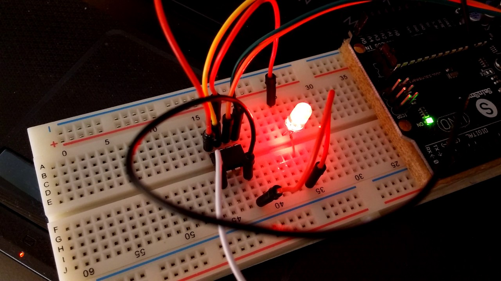
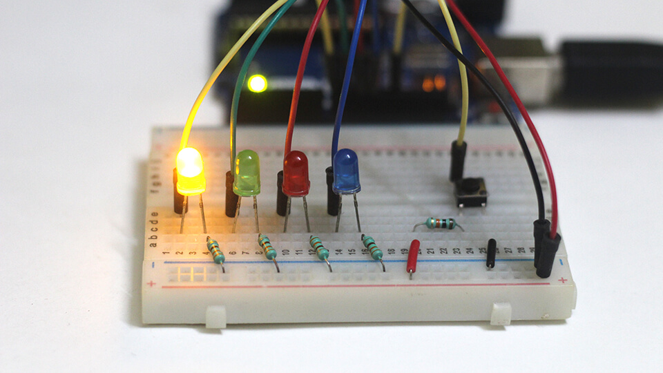

# Week 6

### Labs

In the labs this week, we completed several foundational activities to familiarise ourselves with Arduino and basic electronics:

- **Lab 1:** **LED Blink**  
  First up was the classic LED blink project. I set up my circuit on a breadboard, and when I uploaded my first sketch - seeing the LED light up and blink according to my code was so rewarding! It felt like magic, and I couldn't help but smile at my tiny victory.

  

  [Watch Video](link_to_video_1)

  [Arduino Code](./arduino-code/labs/blink/)

---

- **Lab 2:** **Button and LED**  
  Next, we moved on to connecting a button to control the LED. This was where things started to feel a bit more interactive. I remember the thrill of pressing the button and seeing the LED respond. It was such a simple action, but it made me realize how intuitive interaction design can be. This project made me excited about the possibilities of creating more engaging experiences in the future!

  **Wiring the button and LED**  
  

  **Button control demonstration**  
  [Watch Video](link_to_video_2)

  [Arduino Code](./arduino-code/labs/blink/)

---

- **Lab Activity 3:** **Analog Input with Potentiometer**  
  We experimented with a potentiometer to control the brightness of an LED. This was my favorite part because it visually demonstrated how analog signals can affect outputs, giving me a deeper appreciation for responsive design. Adjusting the potentiometer felt satisfying, as I could directly manipulate the light intensity. It emphasized how small changes in input can have significant impacts on the output, which is a crucial concept in design.

  **Potentiometer connected to the LED**  
  

  **Brightness control demonstration**  
  [Watch Video](link_to_video_3)

  [Arduino Code](./arduino-code/labs/blink/)

---

### Project Development

As I embark on the early stages of developing my final project, I’m excited about the concept of creating a sound toy. My initial idea is to design an interactive device that produces various sounds based on user input, encouraging playful exploration and creativity. I'm considering incorporating sensors that respond to touch and movement, allowing users to engage with the toy in a tactile and dynamic way. This project will not only challenge my technical skills but also push me to think about the user experience and the emotional connections that sound can evoke. As I dive deeper into research and prototyping, I'm eager to explore how I can make this sound toy both fun and meaningful, ultimately fostering a deeper engagement with sound and play.
