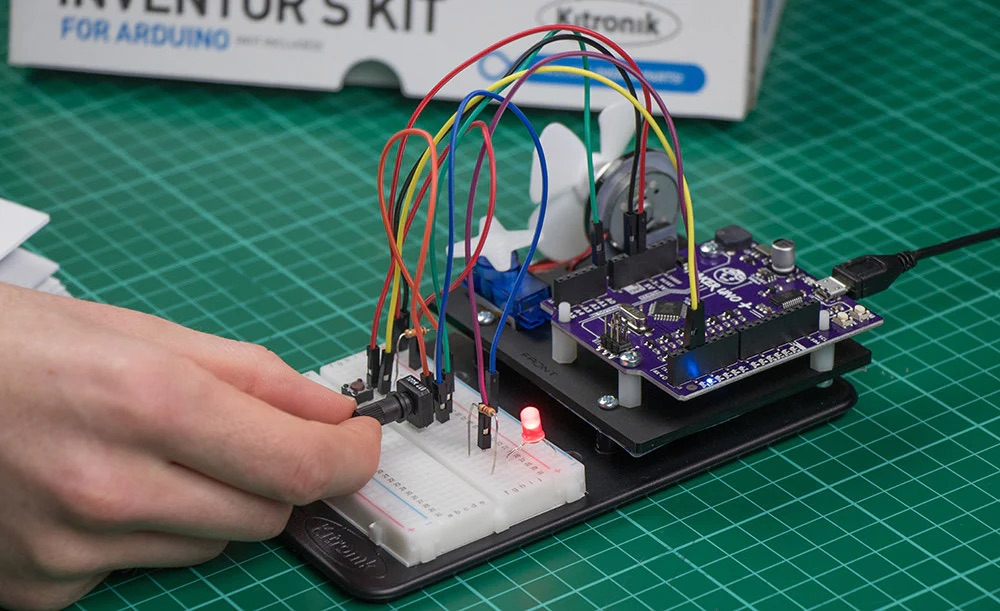

# Week 7

### Labs

In the labs this week, we completed several foundational activities to familiarise ourselves with Arduino and basic electronics:

- **Lab 1:** **LED Blink**  
  First up was the classic LED blink project. I set up my circuit on a breadboard, and when I uploaded my first sketch - seeing the LED light up and blink according to my code was so rewarding! It felt like magic, and I couldn't help but smile at my tiny victory.

  

  [Watch Video](link_to_video_1)

  [Arduino Code](./arduino-code/labs/blink/)

---

- **Lab 2:** **Button and LED**  
  Next, we moved on to connecting a button to control the LED. This was where things started to feel a bit more interactive. I remember the thrill of pressing the button and seeing the LED respond. It was such a simple action, but it made me realize how intuitive interaction design can be. This project made me excited about the possibilities of creating more engaging experiences in the future!

  **Wiring the button and LED**  
  

  **Button control demonstration**  
  [Watch Video](link_to_video_2)

  [Arduino Code](./arduino-code/labs/blink/)

---

- **Lab Activity 3:** **Analog Input with Potentiometer**  
  We experimented with a potentiometer to control the brightness of an LED. This was my favorite part because it visually demonstrated how analog signals can affect outputs, giving me a deeper appreciation for responsive design. Adjusting the potentiometer felt satisfying, as I could directly manipulate the light intensity. It emphasized how small changes in input can have significant impacts on the output, which is a crucial concept in design.

  **Potentiometer connected to the LED**  
  

  **Brightness control demonstration**  
  [Watch Video](link_to_video_3)

  [Arduino Code](./arduino-code/labs/blink/)

---

### Reading & Reflections

This week, my readings profoundly shaped my understanding of material choices and design context in my creative practice. _An Introduction to Discard Studies_ highlighted how the act of discarding materials can perpetuate societal inequalities, prompting me to reflect on how my material selections might affect project accessibility. _Creative Upcycling_ inspired me to consider repurposing old electronics, emphasizing the importance of making technology both accessible and environmentally sustainable. Meanwhile, _The Psychology of Data Visualization_ underscored the impact of design decisions on data perception, which I plan to incorporate into my project visualizations. Collectively, these insights have deepened my awareness of the interconnectedness between materials, social responsibility, and effective design, and I am eager to apply them in my future work.

---

### Peer Support

During our peer support session, we shared our progress on our final projects. I was feeling overwhelmed with the workload and stuck on a few technical build issues, speaking with other helped me troubleshoot and brainstorm possible solutions, which is great!

---

### Project Development

As I continue developing my sound toy project, I'm thrilled to see my initial concept take shape. I've been experimenting with different sensors and sound modules to create a more interactive experience. So far, I’ve incorporated touch sensors that trigger unique soundscapes, encouraging users to explore and create their own auditory experiences. I've also begun designing the toy’s aesthetics, aiming for a playful and inviting look that draws users in. Iterating on feedback from my peers has been invaluable; their insights have prompted me to rethink certain design elements to enhance usability and engagement. I’m now focusing on refining the sound quality and ensuring the toy is durable enough for playful exploration. It’s exciting to see how this project is evolving, and I can’t wait to share the final product!
